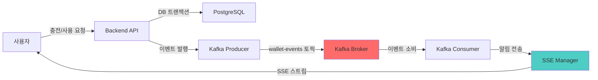
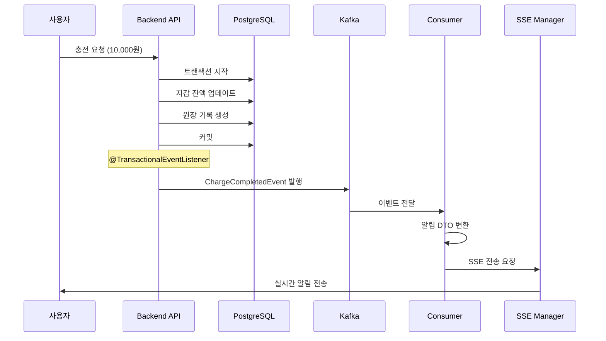

# Kafka 이벤트 시스템 아키텍처

**작성일**: 2026-01-20  
**카테고리**: Architecture  
**관련 컴포넌트**: Backend, Kafka, SSE

---

## 📋 개요

Prepaid Platform은 **Kafka + SSE (Server-Sent Events)** 를 조합하여 **비동기 이벤트 기반 실시간 알림 시스템**을 구현하고 있습니다. 지갑 작업(충전, 사용, 취소)이 완료되면 Kafka를 통해 이벤트를 발행하고, SSE를 통해 사용자에게 실시간으로 알림을 전달합니다.

---

## 🏗️ 전체 아키텍처



**데이터 흐름**:
```
[Business Service] → [Kafka Producer] → [Kafka Topic] → [Kafka Consumer] → [SSE] → [Frontend Client]
```

---

## 📦 인프라 구성

### Kafka 설정

**Docker Compose** ([docker-compose.yml](file:///Users/juahyun/Desktop/project/prepaid/prepaid/docker-compose.yml#L35-L60))

```yaml
kafka:
  image: apache/kafka:3.7.0
  ports:
    - "29092:29092"
  environment:
    KAFKA_NODE_ID: 1
    KAFKA_PROCESS_ROLES: broker,controller
    # KRaft 모드 (Zookeeper 불필요)
```

**특징**:
- ✅ Apache Kafka 3.7.0 (KRaft 모드)
- ✅ 단일 브로커 구성
- ✅ 외부 접속: `localhost:29092`
- ✅ Kafka UI: `localhost:8085`

**Spring Boot 설정** ([application-local.yml](file:///Users/juahyun/Desktop/project/prepaid/prepaid/backend/src/main/resources/application-local.yml#L47-L51))

```yaml
spring:
  kafka:
    bootstrap-servers: localhost:29092
    consumer:
      group-id: prepaid-group
      auto-offset-reset: earliest
```

---

## ⚙️ Kafka 설정 상세

### Producer 설정

[KafkaConfig.java](file:///Users/juahyun/Desktop/project/prepaid/prepaid/backend/src/main/java/com/prepaid/config/KafkaConfig.java#L44-L59)

```java
ProducerFactory<String, WalletEvent> producerFactory()
```

**핵심 설정**:
- **직렬화**: JSON (WalletEvent → JSON)
- **멱등성**: `ENABLE_IDEMPOTENCE_CONFIG = true`
- **신뢰성**: 
  - `ACKS = "all"` (모든 레플리카 확인)
  - `RETRIES = 3`
  - `MAX_IN_FLIGHT_REQUESTS = 5`

### Consumer 설정

[KafkaConfig.java](file:///Users/juahyun/Desktop/project/prepaid/prepaid/backend/src/main/java/com/prepaid/config/KafkaConfig.java#L95-L113)

```java
ConsumerFactory<String, WalletEvent> consumerFactory()
```

**핵심 설정**:
- **역직렬화**: JSON → WalletEvent
- **컨슈머 그룹**: `notification-service`
- **신뢰 패키지**: `com.prepaid.event.domain`
- **오프셋 관리**: `earliest` (처음부터 읽기)
- **커밋 모드**: 자동 커밋 (ErrorHandler 관리)

### 에러 처리

[KafkaConfig.java](file:///Users/juahyun/Desktop/project/prepaid/prepaid/backend/src/main/java/com/prepaid/config/KafkaConfig.java#L119-L148)

**재시도 정책**:
- 간격: 1초
- 횟수: 3회
- 실패 시: DLQ (`wallet-events.DLT`) 전송

```java
DefaultErrorHandler errorHandler = new DefaultErrorHandler(
    recoverer,
    new FixedBackOff(1000L, 3L) // 1초 간격, 3회
);
```

---

## 📨 이벤트 구조

### 이벤트 타입

[EventType.java](file:///Users/juahyun/Desktop/project/prepaid/prepaid/backend/src/main/java/com/prepaid/event/domain/EventType.java)

```java
public enum EventType {
    CHARGE_COMPLETED,      // 충전 완료
    SPEND_COMPLETED,       // 사용 완료  
    REVERSAL_COMPLETED     // 취소 완료
}
```

### 기본 이벤트 클래스

[WalletEvent.java](file:///Users/juahyun/Desktop/project/prepaid/prepaid/backend/src/main/java/com/prepaid/event/domain/WalletEvent.java)

```java
public abstract class WalletEvent {
    private String eventId;         // UUID - 멱등성 보장
    private Long userId;            // 사용자 ID - 파티션 키
    private EventType eventType;    // 이벤트 타입
    private LocalDateTime occurredAt; // 발생 시간
    private Map<String, Object> metadata;
}
```

### 구체적 이벤트

| 이벤트 | 클래스 | 주요 필드 |
|--------|--------|----------|
| 충전 완료 | `ChargeCompletedEvent` | amount, newBalance, paymentKey, orderId |
| 사용 완료 | `SpendCompletedEvent` | amount, newBalance, description |
| 취소 완료 | `ReversalCompletedEvent` | reversedAmount, newBalance, reason |

---

## 🚀 이벤트 발행

### EventPublisher

[EventPublisher.java](file:///Users/juahyun/Desktop/project/prepaid/prepaid/backend/src/main/java/com/prepaid/event/service/EventPublisher.java)

```java
public void publish(WalletEvent event) {
    // userId를 파티션 키로 사용 → 순서 보장
    String partitionKey = event.getUserId().toString();
    
    kafkaTemplate.send(WALLET_EVENTS_TOPIC, partitionKey, event)
        .whenComplete((result, ex) -> {
            // 성공/실패 로깅
        });
}
```

**핵심 특징**:
- **토픽**: `wallet-events`
- **파티션 키**: `userId` → 동일 사용자 이벤트 순서 보장
- **비차단**: 이벤트 발행 실패가 트랜잭션을 롤백시키지 않음
- **비동기 콜백**: 성공/실패 로깅

### 발행 시점

비즈니스 로직에서 트랜잭션 커밋 후 자동 발행:

```java
@TransactionalEventListener(phase = TransactionPhase.AFTER_COMMIT)
public void publishChargeCompletedEvent(...) {
    ChargeCompletedEvent event = new ChargeCompletedEvent(...);
    eventPublisher.publish(event);
}
```

**장점**:
- DB 저장 성공 후에만 이벤트 발행
- 트랜잭션 무결성 보장

---

## 📥 이벤트 소비

### WalletEventConsumer

[WalletEventConsumer.java](file:///Users/juahyun/Desktop/project/prepaid/prepaid/backend/src/main/java/com/prepaid/event/consumer/WalletEventConsumer.java)

```java
@KafkaListener(topics = "wallet-events", 
               groupId = "notification-service")
public void consume(WalletEvent event) {
    // 1. 이벤트 → 알림 DTO 변환
    NotificationDto notification = convertToNotification(event);
    
    // 2. SSE로 사용자에게 전송
    sseConnectionManager.sendToUser(event.getUserId(), notification);
}
```

**처리 흐름**:
1. Kafka에서 이벤트 수신
2. 이벤트 타입별 알림 메시지 생성
3. SSE를 통해 해당 사용자에게 실시간 전송

**알림 변환 예시**:

```java
// 충전 완료
제목: "충전 완료"
메시지: "₩10,000가 충전되었습니다. 현재 잔액: ₩50,000"
타입: success
```

---

## 🔄 전체 흐름 예시

### 충전 시나리오



**단계별 설명**:
1. 사용자가 Toss로 10,000원 충전
2. `LedgerService.recordCharge()` - DB 트랜잭션 처리
3. 트랜잭션 커밋 후 `ChargeCompletedEvent` 발행
4. Kafka Producer가 `wallet-events` 토픽에 전송
5. `WalletEventConsumer`가 이벤트 수신
6. 알림 DTO로 변환 후 SSE로 전송
7. 프론트엔드에서 토스트 알림 표시

---

## ✨ 설계 원칙

### 신뢰성
- ✅ Producer 멱등성 활성화
- ✅ `acks=all` (모든 레플리카 확인)
- ✅ 재시도 3회 (1초 간격)
- ✅ DLQ로 실패 메시지 보존
- ✅ 트랜잭션 커밋 후 이벤트 발행

### 순서 보장
- ✅ `userId`를 파티션 키로 사용
- ✅ 동일 사용자의 이벤트 순서 보장
- ✅ 동일 파티션 내 순차 처리

### 확장성
- ✅ 컨슈머 그룹으로 병렬 처리 가능
- ✅ 파티션 증가로 처리량 확장 가능
- ✅ 이벤트 발행/소비 비동기 분리

### 유연성
- ✅ 이벤트 소싱 패턴 (경량 버전)
- ✅ 새로운 이벤트 타입 추가 용이
- ✅ 새로운 컨슈머 추가 용이 (예: 분석, 감사)

---

## 🔍 모니터링

### Kafka UI
- URL: `http://localhost:8085`
- 기능: 토픽 확인, 메시지 조회, 컨슈머 그룹 모니터링

### 로그 모니터링
- Producer: 발행 성공/실패 로깅
- Consumer: 처리 성공/실패 로깅
- 재시도: 재시도 횟수 및 예외 로깅
- DLQ: 실패 메시지 상세 로깅

---

## 🚧 향후 개선사항

1. **메트릭 수집**: Prometheus + Grafana
2. **알림 확장**: Slack, Email 연동
3. **DLQ 재처리**: 관리자 API 제공
4. **이벤트 저장소**: 감사 로그용 영구 저장
5. **파티션 증가**: 처리량 증가 시 확장

---

## 📚 관련 문서

- [Kafka 재시도 + DLQ 구현](../backend/kafka-retry-dlq.md)
- Toss 결제 연동 (예정)
- SSE 실시간 알림 (예정)

---

**Last Updated**: 2026-01-20
