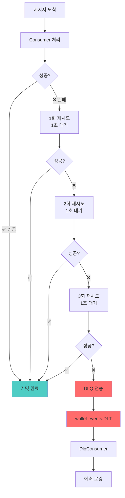

# Kafka 재시도 + DLQ 구현

**작성일**: 2026-01-20  
**카테고리**: Backend Implementation  
**관련 파일**: `KafkaConfig.java`, `WalletEventConsumer.java`, `DlqConsumer.java`

---

## 📝 구현 개요

Kafka consumer의 에러 처리를 개선하여 **재시도 로직**과 **DLQ (Dead Letter Queue)**를 구현했습니다. 이를 통해 일시적 장애는 자동 복구하고, 영구적 실패는 별도 관리할 수 있게 되었습니다.

---

## 🎯 문제점

### 기존 코드의 문제
```java
@KafkaListener(topics = "wallet-events")
public void consume(WalletEvent event, Acknowledgment ack) {
    try {
        // 처리 로직
        ack.acknowledge(); // 성공 시 커밋
    } catch (Exception e) {
        log.error("처리 실패", e);
        ack.acknowledge(); // ❌ 에러여도 커밋 → 메시지 손실!
    }
}
```

**문제점**:
- ❌ 일시적 장애(네트워크 타임아웃, SSE 연결 끊김)도 재시도 없이 손실
- ❌ 에러 메시지 추적 어려움
- ❌ 메시지 손실 가능성

---

## ✅ 해결 방안

### Spring Kafka ErrorHandler 활용

```java
DefaultErrorHandler errorHandler = new DefaultErrorHandler(
    new DeadLetterPublishingRecoverer(dlqKafkaTemplate),
    new FixedBackOff(1000L, 3L) // 1초 간격, 3회 재시도
);
```

**장점**:
- ✅ 일시적 장애 자동 복구 (재시도 3회)
- ✅ 영구적 실패는 DLQ로 보존
- ✅ 메시지 손실 방지
- ✅ 코드 간소화 (try-catch 불필요)

---

## 🔧 구현 내역

### 1. KafkaConfig 개선

[KafkaConfig.java](file:///Users/juahyun/Desktop/project/prepaid/prepaid/backend/src/main/java/com/prepaid/config/KafkaConfig.java)

#### 추가된 빈

**DLQ용 Producer**:
```java
@Bean
public ProducerFactory<String, Object> dlqProducerFactory() {
    // DLQ 전송용 프로듀서
}

@Bean
public KafkaTemplate<String, Object> dlqKafkaTemplate() {
    return new KafkaTemplate<>(dlqProducerFactory());
}
```

**ErrorHandler**:
```java
@Bean
public CommonErrorHandler errorHandler(KafkaTemplate<String, Object> dlqKafkaTemplate) {
    // DLQ recoverer: 실패한 메시지를 DLT 토픽으로 전송
    DeadLetterPublishingRecoverer recoverer = 
        new DeadLetterPublishingRecoverer(dlqKafkaTemplate,
            (record, exception) -> {
                String dlqTopic = record.topic() + ".DLT";
                return new TopicPartition(dlqTopic, record.partition());
            });
    
    // 재시도 정책: 1초 간격, 3회
    DefaultErrorHandler errorHandler = new DefaultErrorHandler(
        recoverer,
        new FixedBackOff(1000L, 3L)
    );
    
    // 재시도 로깅
    errorHandler.setRetryListeners((record, ex, deliveryAttempt) ->
        log.warn("재시도 중: attempt={}/{}", deliveryAttempt, 3)
    );
    
    return errorHandler;
}
```

#### 설정 변경

| 항목 | 이전 | 이후 |
|------|------|------|
| 커밋 모드 | `MANUAL` | `BATCH` |
| 자동 커밋 | `false` | `true` |
| 에러 처리 | 수동 try-catch | ErrorHandler |

---

### 2. WalletEventConsumer 간소화

[WalletEventConsumer.java](file:///Users/juahyun/Desktop/project/prepaid/prepaid/backend/src/main/java/com/prepaid/event/consumer/WalletEventConsumer.java)

#### Before (수동 처리)
```java
public void consume(WalletEvent event, Acknowledgment ack) {
    try {
        // 비즈니스 로직
        ack.acknowledge(); // 수동 커밋
    } catch (Exception e) {
        log.error("실패", e);
        ack.acknowledge(); // 에러여도 커밋
    }
}
```

#### After (자동 처리)
```java
public void consume(WalletEvent event) {
    // 비즈니스 로직만 작성
    // 예외 발생 시 ErrorHandler가 자동으로:
    // 1. 재시도 (1초 간격 3회)
    // 2. 재시도 실패 시 DLQ 전송
}
```

**개선 효과**:
- 코드 27줄 → 19줄 (30% 감소)
- try-catch 제거
- Acknowledgment 파라미터 제거

---

### 3. DLQ Consumer 신규 생성

[DlqConsumer.java](file:///Users/juahyun/Desktop/project/prepaid/prepaid/backend/src/main/java/com/prepaid/event/consumer/DlqConsumer.java)

```java
@Service
@Slf4j
public class DlqConsumer {
    
    @KafkaListener(topics = "wallet-events.DLT", groupId = "dlq-monitor")
    public void consumeDeadLetter(ConsumerRecord<String, Object> record) {
        log.error("========================================");
        log.error("DLQ 메시지 수신 - 재시도 3회 실패");
        log.error("Topic: {}", record.topic());
        log.error("Key: {}", record.key());
        log.error("Value: {}", record.value());
        
        // 헤더에서 예외 정보 추출
        record.headers().forEach(header -> {
            if (header.key().contains("exception")) {
                log.error("Exception: {}", new String(header.value()));
            }
        });
        
        log.error("========================================");
        
        // TODO: Slack 알림, DB 저장, 재처리 API 등
    }
}
```

**주요 기능**:
- 📊 실패 메시지 상세 로깅
- 🔍 예외 정보 분석
- 📋 토픽/파티션/오프셋 기록

**향후 확장**:
- Slack/Email 알림
- 데이터베이스 저장
- 관리자 대시보드 연동
- 수동 재처리 API

---

## 🔄 에러 처리 플로우



---

## 📊 개선 효과

### 메시지 신뢰성

| 항목 | 이전 | 이후 |
|------|------|------|
| 에러 시 메시지 손실 | ⚠️ 가능 | ✅ 방지 |
| 일시적 장애 복구 | ❌ 불가능 | ✅ 자동 3회 재시도 |
| 영구 실패 관리 | ⚠️ 로그만 | ✅ DLQ 보존 |
| 에러 모니터링 | ⚠️ 로그 검색 | ✅ 중앙 집중 |

### 코드 품질

- **간소화**: 27줄 → 19줄 (30% 감소)
- **책임 분리**: 비즈니스 로직 / 에러 처리 분리
- **표준 패턴**: Spring Kafka 권장 방식

### 운영 효율성

- **자동 복구**: 일시적 장애 자동 해결
- **알림 준비**: DLQ 모니터링 기반 마련
- **재처리 가능**: DLQ 메시지 재처리 가능

---

## 📋 로그 예시

### 정상 처리
```
INFO  - 이벤트 수신: eventId=abc-123, type=CHARGE_COMPLETED, userId=1
INFO  - 이벤트 처리 완료: eventId=abc-123, type=CHARGE_COMPLETED
```

### 재시도 중
```
INFO  - 이벤트 수신: eventId=def-456, type=SPEND_COMPLETED, userId=2
WARN  - 메시지 재시도 중: topic=wallet-events, attempt=1/3, exception=Connection timeout
WARN  - 메시지 재시도 중: topic=wallet-events, attempt=2/3, exception=Connection timeout
INFO  - 이벤트 처리 완료: eventId=def-456, type=SPEND_COMPLETED
```

### DLQ 전송
```
ERROR - 메시지 DLQ 전송: topic=wallet-events, dlqTopic=wallet-events.DLT, key=3
ERROR - ========================================
ERROR - DLQ 메시지 수신 - 재시도 3회 실패
ERROR - Topic: wallet-events.DLT
ERROR - Key: 3
ERROR - Value: {"eventId":"ghi-789",...}
ERROR - ========================================
```

---

## 🧪 테스트 시나리오

### 1. 정상 케이스 ✅
**시나리오**: 충전/사용/취소 이벤트가 정상 처리되는지 확인

**검증 항목**:
- Kafka 메시지 수신
- SSE 알림 전송
- 커밋 완료

### 2. 일시적 장애 케이스 🔄
**시나리오**: SSE 연결이 일시적으로 끊겼을 때

**예상 동작**:
- 1회 재시도 → 성공
- 로그에 재시도 기록
- 최종적으로 알림 전송 성공

### 3. DLQ 전송 케이스 💀
**시나리오**: 잘못된 데이터 형식으로 파싱 실패

**예상 동작**:
- 3회 재시도 (모두 실패)
- DLQ 토픽으로 전송
- DlqConsumer가 수신 및 로깅

---

## 🚀 다음 단계

1. **통합 테스트**: 재시도 및 DLQ 로직 검증
2. **모니터링 대시보드**: Kafka UI에서 DLQ 확인
3. **알림 시스템**: Slack 연동
4. **재처리 API**: DLQ 메시지 수동 재처리
5. **메트릭 수집**: Prometheus + Grafana

---

## 📚 관련 문서

- [Kafka 아키텍처](../architecture/kafka-architecture.md)
- Spring Kafka 공식 문서: [Error Handling](https://docs.spring.io/spring-kafka/reference/kafka/annotation-error-handling.html)

---

## 📁 수정된 파일

- [KafkaConfig.java](file:///Users/juahyun/Desktop/project/prepaid/prepaid/backend/src/main/java/com/prepaid/config/KafkaConfig.java)
- [WalletEventConsumer.java](file:///Users/juahyun/Desktop/project/prepaid/prepaid/backend/src/main/java/com/prepaid/event/consumer/WalletEventConsumer.java)
- [DlqConsumer.java](file:///Users/juahyun/Desktop/project/prepaid/prepaid/backend/src/main/java/com/prepaid/event/consumer/DlqConsumer.java) (신규)

---

**Last Updated**: 2026-01-20
