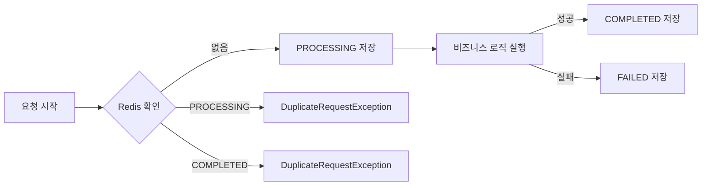

# 선불관리 서비스 Phase 1 & 2 개선 완료

**작성일**: 2026-01-20  
**카테고리**: Backend Implementation  
**관련 커밋**: `3227421`

---

## 📝 구현 개요

선불관리 서비스를 MVP에서 프로덕션 레디로 개선했습니다. 예외 처리, 금액 검증, 멱등성 보장, 감사 로그 등 핵심 기능을 구현했습니다.

---

## ✅ Phase 1: 기반 시스템 (P0 - 필수)

### 1. 예외 처리 시스템

#### 생성된 파일
- [BusinessException.java](file:///Users/juahyun/Desktop/project/prepaid/prepaid/backend/src/main/java/com/prepaid/common/exception/BusinessException.java) - 비즈니스 예외 최상위 클래스
- [ErrorCode.java](file:///Users/juahyun/Desktop/project/prepaid/prepaid/backend/src/main/java/com/prepaid/common/exception/ErrorCode.java) - 에러 코드 Enum (15개 코드 정의)
- [GlobalExceptionHandler.java](file:///Users/juahyun/Desktop/project/prepaid/prepaid/backend/src/main/java/com/prepaid/common/exception/GlobalExceptionHandler.java) - `@RestControllerAdvice`로 전역 예외 처리
- [ErrorResponse.java](file:///Users/juahyun/Desktop/project/prepaid/prepaid/backend/src/main/java/com/prepaid/common/dto/ErrorResponse.java) - 일관된 에러 응답 DTO
- 5개 커스텀 예외 클래스

#### 에러 응답 예시
```json
{
  "errorCode": "INSUFFICIENT_BALANCE",
  "message": "현재 잔액: 5000원, 요청 금액: 10000원",
  "timestamp": "2026-01-20T20:30:00",
  "path": "/api/payments/use"
}
```

#### 개선 효과
| 항목 | 이전 | 이후 |
|------|------|------|
| 에러 타입 | 모두 500 | 적절한 HTTP 상태 코드 |
| 에러 메시지 | 일관성 없음 | 구조화된 JSON 응답 |
| 클라이언트 처리 | 불가능 | errorCode로 분기 가능 |

---

### 2. 금액 검증

#### 생성된 파일
- [PaymentValidator.java](file:///Users/juahyun/Desktop/project/prepaid/prepaid/backend/src/main/java/com/prepaid/payment/validation/PaymentValidator.java) - 금액 검증 서비스
- [application-local.yml](file:///Users/juahyun/Desktop/project/prepaid/prepaid/backend/src/main/resources/application-local.yml#L77-L85) - 금액 설정

#### 검증 규칙
```yaml
payment:
  charge:
    min-amount: 1000        # 최소 1,000원
    max-amount: 1000000     # 최대 1,000,000원
    daily-limit: 5000000    # 일일 5,000,000원
  use:
    min-amount: 100
    max-amount: 1000000
```

#### 일일 한도 추적
- **Redis 키**: `daily:charge:2026-01-20:123` (날짜 + userId)
- **TTL**: 자정까지 (자동 만료)
- **동작**: 충전 성공 시 누적 금액 업데이트

#### 적용 위치
- `PaymentService.confirmPayment()` - 충전 전 검증
- `LedgerService.useBalance()` - 사용 전 검증

---

### 3. 멱등성 구현

#### 생성된 파일
- [IdempotencyService.java](file:///Users/juahyun/Desktop/project/prepaid/prepaid/backend/src/main/java/com/prepaid/common/idempotency/IdempotencyService.java) - Redis 기반 멱등성 관리
- [IdempotentRequest.java](file:///Users/juahyun/Desktop/project/prepaid/prepaid/backend/src/main/java/com/prepaid/common/idempotency/IdempotentRequest.java) - 요청 상태 DTO

#### 상태 흐름


#### API 사용법
```http
POST /api/payments/confirm
Idempotency-Key: abc-123-def-456
Content-Type: application/json

{
  "amount": 10000,
  "orderId": "order-123",
  "paymentKey": "toss-key-456"
}
```

#### TTL 설정
- **성공/처리중**: 24시간
- **실패**: 10분 (재시도 허용)

---

## ✅ Phase 2: 핵심 기능 (P1)

### 5. 감사 로그 시스템

#### 아키텍처
```
[PaymentController] → [AuditEventPublisher] → [audit-events 토픽] 
→ [AuditEventConsumer] → [PostgreSQL] + [Elasticsearch (향후)]
```

#### 생성된 파일
- [AuditLog.java](file:///Users/juahyun/Desktop/project/prepaid/prepaid/backend/src/main/java/com/prepaid/audit/domain/AuditLog.java) - Entity (인덱스 최적화)
- [AuditEvent.java](file:///Users/juahyun/Desktop/project/prepaid/prepaid/backend/src/main/java/com/prepaid/audit/event/AuditEvent.java) - Kafka 이벤트 DTO
- [AuditEventPublisher.java](file:///Users/juahyun/Desktop/project/prepaid/prepaid/backend/src/main/java/com/prepaid/audit/service/AuditEventPublisher.java) - 발행 서비스
- [AuditEventConsumer.java](file:///Users/juahyun/Desktop/project/prepaid/prepaid/backend/src/main/java/com/prepaid/audit/consumer/AuditEventConsumer.java) - 소비 서비스
- [AuditLogRepository.java](file:///Users/juahyun/Desktop/project/prepaid/prepaid/backend/src/main/java/com/prepaid/audit/repository/AuditLogRepository.java) - Repository

#### 저장되는 정보
```java
{
  "userId": 123,
  "action": "CHARGE",
  "amount": 10000,
  "ipAddress": "192.168.1.1",
  "userAgent": "Mozilla/5.0...",
  "result": "SUCCESS",
  "referenceId": "order-123",
  "timestamp": "2026-01-20T20:30:00"
}
```

#### 인덱스 설계
```sql
idx_user_timestamp: (user_id, timestamp)  -- 사용자별 조회
idx_action: (action)                       -- 액션별 집계
idx_timestamp: (timestamp)                 -- 시간순 정렬
```

#### 적용 위치
- `PaymentController.confirmPayment()` - 충전 성공/실패
- `PaymentController.useBalance()` - 사용 성공/실패

---

## 📊 전체 통계

### 생성된 파일: 18개
- 예외 처리: 9개
- 금액 검증: 1개  
- 멱등성: 2개
- 감사 로그: 5개
- 기타: 1개 (RefundRequest DTO)

### 수정된 파일: 5개
- `KafkaConfig.java` - AuditEvent Producer 추가
- `PaymentController.java` - 멱등성, 감사 로그 적용
- `PaymentService.java` - 금액 검증 추가
- `LedgerService.java` - 커스텀 예외, 금액 검증 적용
- `application-local.yml` - 금액 설정 추가

### 코드 변경량
- **추가**: 1139줄
- **삭제**: 34줄
- **순증가**: 1105줄

---

## 🔍 검증

### 컴파일 검증
```bash
$ ./gradlew compileJava
BUILD SUCCESSFUL in 815ms
```

### 작동 예시

#### 1. 잔액 부족 시
```json
{
  "errorCode": "INSUFFICIENT_BALANCE",
  "message": "현재 잔액: 5000원, 요청 금액: 10000원"
}
```
**HTTP Status**: 400 Bad Request

#### 2. 최소 금액 미만
```json
{
  "errorCode": "BELOW_MINIMUM_CHARGE",
  "message": "최소 충전 금액은 1,000원입니다."
}
```

#### 3. 일일 한도 초과
```json
{
  "errorCode": "EXCEEDS_DAILY_LIMIT",
  "message": "일일 충전 한도(5,000,000원)를 초과합니다. 현재 충전액: 4,800,000원"
}
```

#### 4. 중복 요청
```json
{
  "errorCode": "DUPLICATE_REQUEST",
  "message": "이미 처리된 요청입니다."
}
```
**HTTP Status**: 409 Conflict

---

## 🚀 다음 단계

### TODO (향후 구현)
- [ ] RefundService 구현 (환불 기능)
- [ ] Elasticsearch 연동 (검색 최적화)
- [ ] 30일 아카이빙 스케줄러
- [ ] API 문서화 (Swagger)
- [ ] Spring Boot Actuator (모니터링)

### 권장사항
1. **통합 테스트 작성**: 예외 처리, 멱등성, 감사 로그 검증
2. **Elasticsearch 설정**: docker-compose에 추가
3. **모니터링 대시보드**: Kafka UI, Grafana에서 감사 로그 확인

---

## 📁 관련 문서

- [Kafka 아키텍처](../architecture/kafka-architecture.md)
- [Kafka 재시도 + DLQ 구현](./kafka-retry-dlq.md)
- [구현 계획서](../../.gemini/antigravity/brain/8e13eaf4-a25c-4c6f-8fb6-8c52fd5ae1af/implementation_plan.md)

---

**Last Updated**: 2026-01-20  
**Commit**: `3227421`
