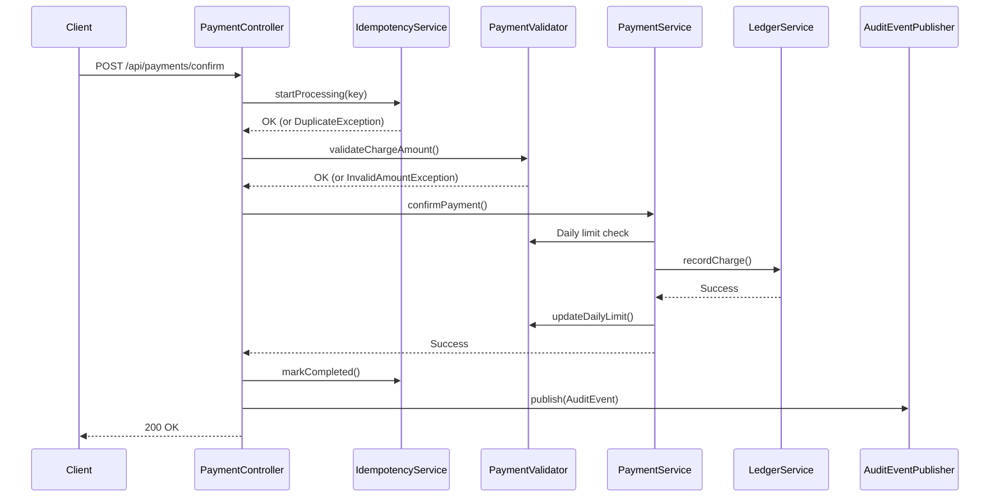

# 선불관리 서비스 개선 완료 (Phase 1-3)

**작성일**: 2026-01-20  
**카테고리**: Backend Implementation

---

## 📝 전체 구현 개요

선불관리 서비스를 MVP에서 프로덕션 레디로 개선했습니다. Phase 1-3까지 완료하여 예외 처리, 금액 검증, 멱등성, 감사 로그, API 문서화, 모니터링 구현을 완료했습니다.

---

## ✅ Phase 1: 기반 시스템 (P0 - 필수) ✅

### 1. 예외 처리 시스템

#### 구조
```
├── BusinessException (최상위)
├── ErrorCode (15개 에러 코드)
├── GlobalExceptionHandler (@RestControllerAdvice)
├── ErrorResponse (JSON DTO)
└── 5개 커스텀 예외
```

#### 에러 응답
```json
{
  "errorCode": "INSUFFICIENT_BALANCE",
  "message": "현재 잔액: 5000원, 요청 금액: 10000원",
  "timestamp": "2026-01-20T20:30:00",
  "path": "/api/payments/use"
}
```

---

### 2. 금액 검증

#### 설정 ([application-local.yml](file:///Users/juahyun/Desktop/project/prepaid/prepaid/backend/src/main/resources/application-local.yml))
```yaml
payment:
  charge:
    min-amount: 1000
    max-amount: 1000000
    daily-limit: 5000000
  use:
    min-amount: 100
    max-amount: 1000000
```

#### 일일 한도 추적
- Redis 키: `daily:charge:2026-01-20:123`
- TTL: 자정까지 자동 만료

---

### 3. 멱등성 구현

#### 사용법
```http
POST /api/payments/confirm
Idempotency-Key: uuid-12345
```

#### 상태 관리
- **PROCESSING**: 처리 중 (24시간)
- **COMPLETED**: 완료 (24시간)
- **FAILED**: 실패 (10분, 재시도 가능)

---

## ✅ Phase 2: 핵심 기능 (P1) ✅

### 5. 감사 로그 시스템

#### 아키텍처
```
PaymentController → AuditEventPublisher → audit-events 
→ AuditEventConsumer → PostgreSQL
```

#### 저장 정보
- userId, action, amount
- ipAddress, userAgent
- result (SUCCESS/FAILED)
- referenceId, timestamp

#### 인덱스
```sql
idx_user_timestamp: (user_id, timestamp)
idx_action: (action)
idx_timestamp: (timestamp)
```

---

## ✅ Phase 3: 개발 경험 (P2) ✅

### 6. API 문서화

#### Swagger UI
- **URL**: `http://localhost:8080/swagger-ui.html`
- **API Docs**: `http://localhost:8080/api-docs`

#### 적용된 어노테이션
```java
@Tag(name = "Payment")
@Operation(summary = "충전 확인")
@ApiResponses({
    @ApiResponse(responseCode = "200"),
    @ApiResponse(responseCode = "400", 
        content = @Content(schema = @Schema(implementation = ErrorResponse.class)))
})
```

---

### 7. 모니터링 (Actuator + Prometheus)

#### Actuator 엔드포인트
- `http://localhost:8080/actuator/health` - 상태 체크
- `http://localhost:8080/actuator/metrics` - 메트릭 목록
- `http://localhost:8080/actuator/prometheus` - Prometheus 형식

#### 설정
```yaml
management:
  endpoints:
    web:
      exposure:
        include: health,info,metrics,prometheus
  metrics:
    export:
      prometheus:
        enabled: true
```

---

## 📊 전체 통계

### 생성된 파일: 21개
| Phase | 파일 수 | 주요 파일 |
|-------|---------|----------|
| Phase 1 | 12개 | BusinessException, ErrorCode, PaymentValidator |
| Phase 2 | 6개 | AuditLog, AuditEventPublisher, AuditEventConsumer |
| Phase 3 | 3개 | OpenApiConfig, docs 복사 |

### 수정된 파일: 6개
- `build.gradle` - 의존성 추가
- `KafkaConfig.java` - AuditEvent Producer
- `PaymentController.java` - 멱등성, 감사, Swagger
- `PaymentService.java` - 금액 검증
- `LedgerService.java` - 예외, 검증
- `application-local.yml` - 설정 추가

### 커밋 히스토리
- **Commit 1**: Phase 1 & 2 (1139줄 추가)
- **Commit 2**: Phase 3 (문서화, 모니터링)

---

## 🧪 테스트 가이드

### 1. Swagger UI 테스트
```bash
# 서버 시작
$ ./gradlew bootRun

# 브라우저 접속
http://localhost:8080/swagger-ui.html

# Try it out으로 API 테스트
```

### 2. 예외 처리 테스트

#### 잔액 부족
```bash
curl -X POST http://localhost:8080/api/payments/use \
  -H "Idempotency-Key: test-123" \
  -H "Content-Type: application/json" \
  -d '{"amount": 999999999, "merchantUid": "m-123"}'

# 응답: 400 Bad Request
{
  "errorCode": "INSUFFICIENT_BALANCE",
  "message": "현재 잔액: 5000원, 요청 금액: 999999999원"
}
```

#### 최소 금액 미만
```bash
curl -X POST http://localhost:8080/api/payments/confirm \
  -H "Idempotency-Key: test-456" \
  -d '{"amount": 500, ...}'

# 응답: 400 Bad Request
{
  "errorCode": "BELOW_MINIMUM_CHARGE",
  "message": "최소 충전 금액은 1,000원입니다."
}
```

#### 중복 요청
```bash
# 동일한 Idempotency-Key로 2번 요청
curl -X POST ... -H "Idempotency-Key: same-key"
curl -X POST ... -H "Idempotency-Key: same-key"

# 응답: 409 Conflict
{
  "errorCode": "DUPLICATE_REQUEST",
  "message": "이미 처리된 요청입니다."
}
```

### 3. 모니터링 테스트

```bash
# Health Check
curl http://localhost:8080/actuator/health

# Prometheus 메트릭
curl http://localhost:8080/actuator/prometheus
```

### 4. 감사 로그 확인

```bash
# PostgreSQL 접속
$ docker exec -it prepaid-db psql -U user -d prepaid

# 감사 로그 조회
SELECT * FROM audit_logs ORDER BY timestamp DESC LIMIT 10;

# 사용자별 조회
SELECT * FROM audit_logs WHERE user_id = 123;

# 액션별 집계
SELECT action, result, COUNT(*) 
FROM audit_logs 
GROUP BY action, result;
```

---

## 🔄 데이터 흐름

### 충전 요청 흐름


---

## 📁 프로젝트 구조

```
backend/src/main/java/com/prepaid/
├── common/
│   ├── dto/
│   │   └── ErrorResponse.java
│   ├── exception/
│   │   ├── BusinessException.java
│   │   ├── ErrorCode.java
│   │   ├── GlobalExceptionHandler.java
│   │   └── specific/ (5개 예외)
│   └── idempotency/
│       ├── IdempotencyService.java
│       └── IdempotentRequest.java
├── payment/
│   └── validation/
│       └── PaymentValidator.java
├── audit/
│   ├── domain/AuditLog.java
│   ├── event/AuditEvent.java
│   ├── service/AuditEventPublisher.java
│   ├── consumer/AuditEventConsumer.java
│   └── repository/AuditLogRepository.java
├── config/
│   ├── KafkaConfig.java
│   └── OpenApiConfig.java
└── controller/
    └── PaymentController.java

docs/backend/
├── kafka-architecture.md
├── kafka-retry-dlq.md
├── phase1-2-improvements.md
└── improvement-plan.md
```

---

## 🚀 다음 단계 (TODO)

### Phase 2 미완료
- [ ] RefundService 구현 (환불 기능)
- [ ] Elasticsearch 연동
- [ ] 30일 아카이빙 스케줄러

### Phase 4 (선택)
- [ ] 포인트 만료 기능
- [ ] @CurrentUser ArgumentResolver
- [ ] 단위 테스트 추가

---

## 💡 권장사항

### 1. Elasticsearch 연동
```yaml
# docker-compose.yml
elasticsearch:
  image: elasticsearch:8.11.0
  ports:
    - "9200:9200"
  environment:
    - discovery.type=single-node
    - xpack.security.enabled=false
```

### 2. Grafana 대시보드
- Prometheus로 메트릭 수집
- Grafana로 시각화
- 알람 설정 (충전 실패율, 응답 시간 등)

### 3. 통합 테스트
```java
@SpringBootTest
@AutoConfigureMockMvc
class PaymentIntegrationTest {
    @Test
    void 중복_요청_방지_테스트() {
        // Idempotency-Key 테스트
    }
    
    @Test
    void 일일_한도_초과_테스트() {
        // PaymentValidator 테스트
    }
}
```

---

## 📚 관련 문서

- [Kafka 아키텍처](../architecture/kafka-architecture.md)
- [Kafka 재시도 + DLQ](./kafka-retry-dlq.md)
- [구현 계획서](./improvement-plan.md)

---

**최종 업데이트**: 2026-01-20 21:22  
**완료 Phase**: 1, 2 (일부), 3
